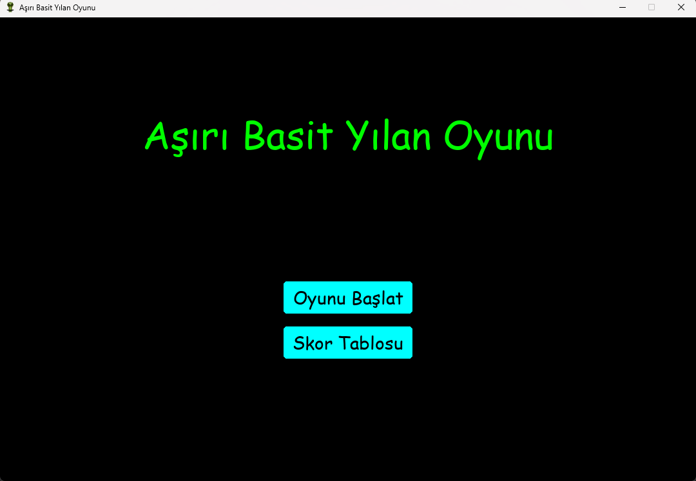
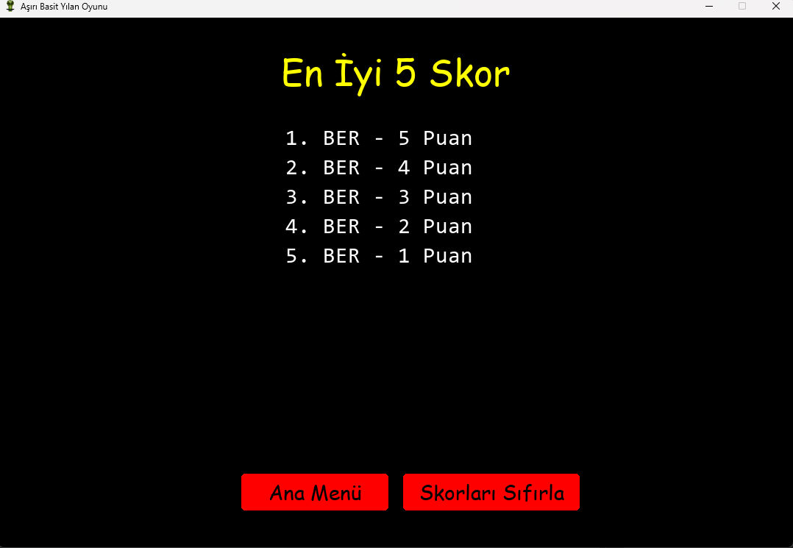
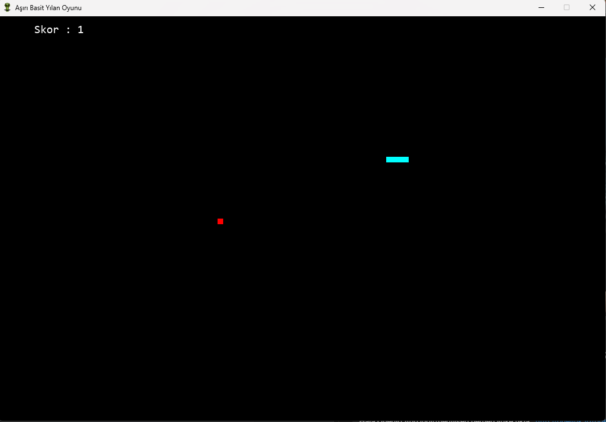

# 🐍 Aşırı Basit Yılan Oyunu
Adından da anlaşılacağı gibi gerçekten çok basit bir şekilde hazırlanmış bir yılan oyunu. Tamamen keyfi hazırlanmış bir oyun.

Bu proje, klasik **yılan oyununu** Pygame kütüphanesi ile Python dilinde modern ve renkli bir şekilde yeniden tasarlamaktadır. Başlangıç ekranı, skor kaydı, TOP 5 skor listesi, renkli yılan ve yiyecekler, ses efektleri ve daha fazlası ile zenginleştirilmiştir.

## 🎮 Özellikler

- 🐍 Klasik yılan oyunu mekaniği
- 🎨 Renkli yılan ve yiyecekler (her yem sonrası renk değişir)
- 🎵 Her yem yendiğinde ses efekti (sinüzoidal beep sesi)
- 🧠 3 harfli isim girerek skor kaydı
- 🏆 En yüksek 5 skorun tutulduğu skor tablosu (JSON dosyasında saklanır)
- 🔄 Oyun bittiğinde yeniden başlat veya ana menüye dön seçenekleri
- 📜 Skorları sıfırlama butonu
- 🖱️ Sadece fare ile kontrol edilen kullanıcı dostu menüler
- 🖼 Özel oyun simgesi (`yilan.ico`)

## 📷 Ekran Görüntüleri

### Başlangıç Ekranı

### Skor Tablosu

### Oyun Ekranı

## ⚙️ Kurulum

> Bu proje Python 3 ve `pygame`, `numpy` gibi kütüphaneleri gerektirir.
